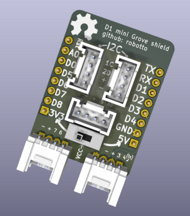
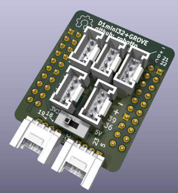

# The boards look like this:

# Kicanvas links:

## [ESP8266 version](https://kicanvas.org/?github=https%3A%2F%2Fgithub.com%2FRobotto%2FD1-mini-grove-shield/tree/main/8266)

## [ESP32 version](https://kicanvas.org/?github=https%3A%2F%2Fgithub.com%2FRobotto%2FD1-mini-grove-shield/tree/main/32)
